# Meeting Notetaker

Local meeting capture for Windows. Records your microphone and the
system audio (whatever is playing through your speakers, including
Teams / Zoom / Meet calls), transcribes both streams on-device with
faster-whisper, captures screenshots of any region you draw, plays
the recording back in-app, and hands the resulting transcript to you
for synthesis by any LLM you trust -- either via clipboard or a
bundled Chrome extension that drives Claude.ai for you. No audio
leaves the machine; no API key required.

> **Status:** v0.7.3. End-to-end capture, transcription, synthesis,
> screen capture, retained-audio playback + export, and transcript-
> synchronized playback all working. v0.7.3 layers a unified Appendix
> system on top of the v0.7.2 Contact model: four new structured
> LLM-emitted sections (Attendee Context, Attendee Details, Suggested
> Topics, Referenced Attachments) get parsed into a sidecar JSON
> store, surfaced in a collapsible tray below the My Notes + Synthesis
> editors, edited via a tabular dialog, and bundled into preview / PDF
> / ZIP exports as a clean Markdown table view. Pre-export prompts
> let the user pick which Appendix sections to include (configurable
> defaults in Settings); cancel buttons + a status-log dialog cover
> long-running exports; folder-mode replaces the zip step when the
> user is dropping output on OneDrive or a shared drive.
>
> **What this tool is.** A note-synthesis pipeline, not a verbatim
> transcription product. The transcript exists to seed an LLM
> synthesis pass; the LLM smooths the kinds of errors a CPU-only
> Whisper run produces (homophones like "there" vs "their", mild
> punctuation drift, occasional dropped articles). If you need
> legal-grade verbatim transcripts, use Teams' built-in
> transcription or a hosted service -- this app trades raw accuracy
> for local-only processing, low CPU cost, and an LLM-friendly
> transcript that synthesizes well.
>
> **Diarization (speaker identification) is rough.** The current
> pass reliably separates two or three distinct voices in clean
> audio, but a four-person meeting routinely splits into 20+
> "speakers" depending on mic, codec, and noise floor. The goal is
> *sufficient speaker context to attribute concepts and discussion
> threads to the right person* -- not perfect labeling. The
> synthesis prompt sees speaker labels as hints, and the LLM is
> fully capable of reconciling "Speaker 7 and Speaker 12 are likely
> the same person" given the surrounding text. Tunable merge /
> match thresholds in Settings, plus live click-to-tag during
> recording, let you correct in-meeting.

## What's new in v0.7.3

Unified Appendix system, better long-running export UX, and a stack
of bug fixes the v0.7.2 thread surfaced. Everything in v0.7.2 still
works the same way; the v0.7.3 additions layer on top.

- **Appendix tray** below the My Notes + Synthesis editors. Six
  collapsible sections render whatever the session carries:
  *Attendee Context* (LLM observations about who participated and
  how), *Attendee Details* (title / company / email / phone, same
  rich-field model as the drawer at the top), *Suggested Topics*,
  *Referenced Attachments* (documents the LLM noticed were
  referenced in the call), *Session Attachments* (live mirror of
  the Attachments tab), and *Links* (every URL across My Notes and
  Synthesis, deduped). Empty sections drop out so the tray header
  reflects only what's present.

  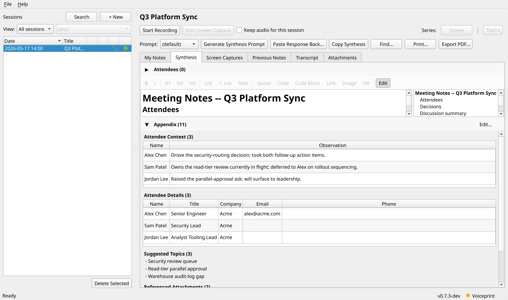

- **Bundled system prompts** ask Claude (or whichever chatbot you
  route through) to emit the four LLM appendices as structured
  JSON code blocks at the bottom of the synthesis. The app parses
  them, persists into a `notes.appendices.json` sidecar in the
  session directory, and renders the tray + the Markdown
  preview / PDF / ZIP exports off the parsed data. The raw JSON
  blocks stay in `notes.md` by default; turning on the
  strip-attendee-appendix Settings toggle removes them from the
  saved file -- the sidecar still has the data so the tray stays
  populated.

- **Edit / delete LLM appendix entries.** An "Edit..." button on
  the tray header opens a tabbed dialog with one editable table
  per LLM section. Add Row / Delete Selected buttons cover the
  destructive operations; OK persists to the sidecar AND
  re-renders the JSON blocks inside `notes.md` so the next
  debounced save can't stomp the user's edits.

  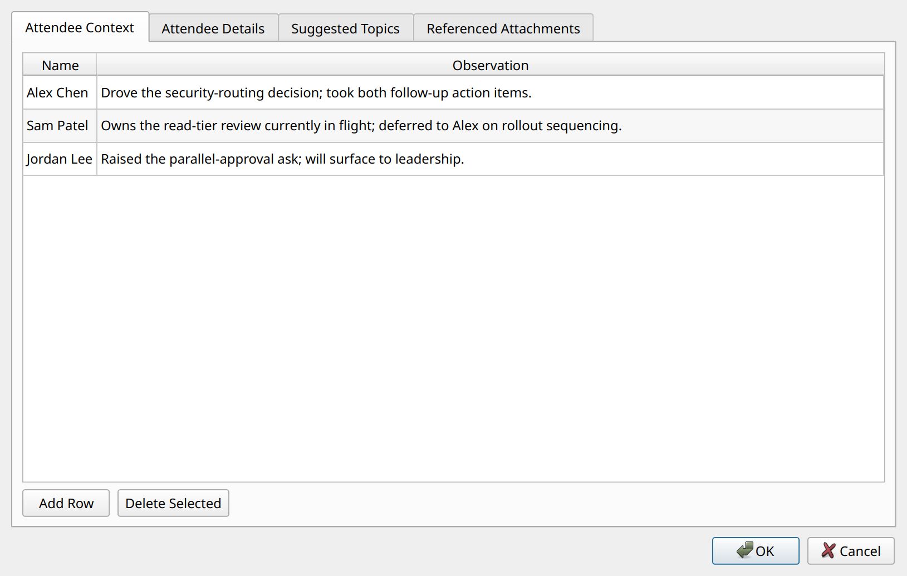

- **Pre-export Appendix inclusion prompt** before every PDF /
  Print / full-session export. Master "Include Appendix" toggle +
  six per-section checkboxes (sections with zero entries show as
  disabled "(empty)" so it's clear they're not a choice).
  Defaults live in Settings -- the bundled choice surfaces the
  user-curated context surfaces (Attendee Context + documents +
  Links) and suppresses the noisier per-person dump and topic
  suggestions, but every checkbox is individually configurable.

  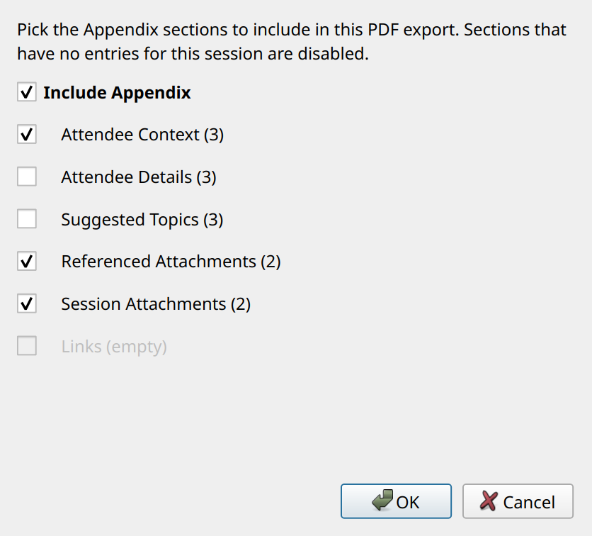

- **Full-session export folder mode.** A new Settings toggle
  (default OFF) decides whether the full-session export writes a
  single `.zip` or an uncompressed subfolder under a user-chosen
  parent directory. Folder mode is the better fit for OneDrive /
  shared-drive destinations where the recipient doesn't want to
  unzip a multi-hundred-MB archive. The app stages output via a
  sibling `.tmp` directory and renames into place so a cancelled
  export never leaves a half-populated destination behind.

- **Cancel button on every export dialog.** Per-session video /
  audio exports and the full-session export now expose a working
  Cancel button. Encoder loops poll a cancellation flag at frame /
  chunk boundaries and unwind cleanly; partial `.mp4` / `.srt` /
  `.zip` / folder output gets deleted before the dialog reports
  back. Status-bar message reads "... cancelled." instead of the
  generic failure dialog.

  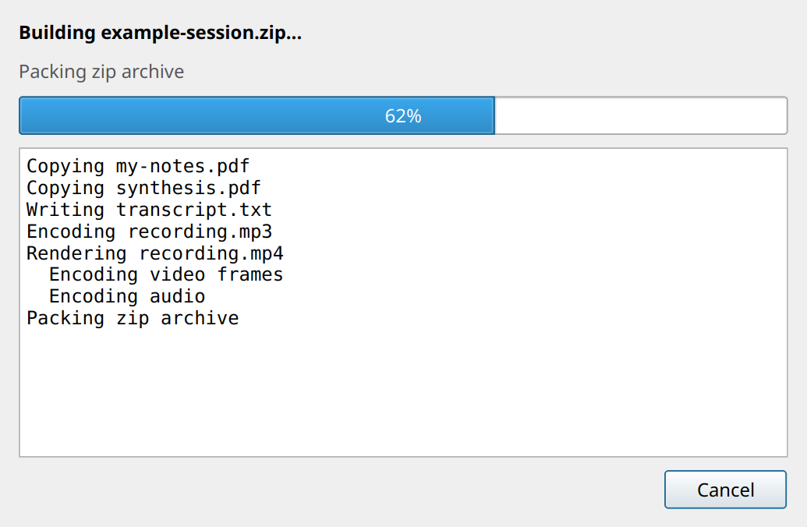

- **Custom ExportProgressDialog for the full-session path.** Bar
  + current-phase label + scrolling activity log of every status
  message the worker emits ("Rendering recording.mp4", "Encoding
  audio", "Packing zip archive"). The log makes a 5-10 minute
  export feel like progress instead of a frozen modal.

- **MP4 quality presets.** Settings > Export gains a low / medium
  / high picker. The default flipped from the v0.7.2-era fixed
  2.5 Mbps (~1.2 GB / hour) to medium (~700 MB / hour). Low
  (~300 MB / hour) is the right pick for slideshow-style
  screenshot content; high preserves the old behavior for users
  who want it.

- **Preview pane attendee table** -- the My Notes and Synthesis
  preview panes apply the same Attendees-bullets-to-rich-fields-
  table transformation the PDF export uses, so the user can see
  what the PDF will look like without exporting first.

- **LLM-suggested topics** merged into the classification bar.
  The existing deterministic noun-phrase extractor still runs; the
  LLM-surfaced topics rank ahead of it so the user sees the
  curated suggestions first.

- **Player bar loading cue.** The transcript-pane scrubber now
  reads "Loading audio..." while the AudioPlayer decode pass
  runs (was a confusingly disabled-looking blank dialog for the
  first few seconds of a long recording).

- **Settings default prompt template surfacing.** The session-view
  prompt dropdown's placeholder now reflects the Settings choice
  -- e.g. "(default: one-on-one)" -- so the user can tell at a
  glance which template will run. The resolution semantics stay
  the same; the picker just stops lying about what's actually
  going to happen.

- **Attendee tag sidebar fills the right column.** Click-to-tag
  speaker buttons in the My Notes recording sidebar now expand to
  fill the full vertical space; scrollbar only appears when the
  attendee list overflows the available height.

- **Bug fixes from the v0.7.3 thread:** the full-session export
  no longer hits 100% prematurely (audio mux + container close
  used to run silently after the bar reached the top of its
  budget); per-tab PDF export now applies the same Appendix
  injection the in-app preview shows (was emitting raw JSON
  blocks).

The full v0.7.3 set lands as a single release; the GitHub issues
list (#52 -- #66) tracks individual items if you want the change-log
granularity. The repo's `default.md` prompt also got a conciseness
pass during this release -- the bundled prompt produces denser,
key-points-up-front Notes sections out of the box.

## What's new in v0.7.2

Rich attendee data + a quieter, less-cluttered classification surface.
v0.7.0/0.7.1 functionality is unchanged; the Contact model gains real
detail and the Outlook calendar path knows how to find it.

- **Rich Contact fields.** Every Contact in the Address Book now
  carries Title, Company, Department, Primary Email, Phone, and free-
  form Notes alongside its display name and aliases. Existing
  databases migrate transparently on first launch.
- **Outlook calendar auto-enrichment.** When you pick a meeting from
  the calendar dialog, Meeting Notetaker resolves each attendee
  through `Recipient.Resolve()` -> `AddressEntry.GetExchangeUser()`
  -> the recipient's MAPI `PropertyAccessor` to pull the real SMTP
  address and the Exchange-listed title/company/department onto the
  Contact. Hybrid / cached-mode quirks where one path returns blanks
  fall through to the next so most attendees come back populated.
  X.500 `legacyExchangeDN` values previously stored as email
  (`/o=ExchangeLabs/...`) get swept out on store open so the next
  Outlook fetch fills the real email.
- **Attendee Details drawer** above My Notes and Synthesis. A
  collapsible table shows the linked Contacts with Name, Title,
  Company, Email, Notes columns + a per-row Edit button that opens
  the Address Book filtered to that contact. Drawer auto-expands the
  My Notes tab when the screen-capture overlay arms so the sidebar
  is visible immediately.
- **Per-field source tracking.** Each rich field records which path
  most recently wrote it (Outlook / LLM / manual). Address Book
  labels and drawer cells carry a small superscript letter as an
  unobtrusive cue (`ᴼ` / `ᴸ` / `ᴹ`); hover tooltips name the source
  in plain English.
- **Calendar attendee auto-merge.** When the calendar path resolves a
  person across both email and name lookups, duplicate Contact rows
  collapse into one canonical row. Pre-merge data isn't lost: each
  duplicate's rich fields fold into the survivor before the merge
  drops the duplicate. Eliminates the "three rows for the same
  person" pattern that the prior split email/name paths produced.
- **Calendar picker loading indicator.** "Loading from Outlook..."
  status text now actually paints before the COM query begins, so
  the 1-2 s GAL fetch is visible work rather than a frozen blank
  dialog. The COM query also runs deferred to the next event-loop
  tick.
- **People button removed from the classification bar.** The drawer
  + the live-notes `# Attendees` list (which auto-syncs to the
  session's Contact links on every keystroke) cover the same data
  surface with a richer view. The bar is now Series | Topics.
- **Settings: Synthesis Prompts** gains a Default template dropdown
  (used by sessions that don't override it via the session view
  picker) and an opt-in checkbox to ask the LLM to also extract
  attendee details into a structured appendix the app parses back
  into Contact fields. The appendix request is off by default --
  Outlook enrichment covers the common case and the appended
  paragraph adds prompt bulk you may not want.
- **UX polish.** Address Book dialog closes on Enter (matches Close
  button); attendee drawer has no row-hover / row-select highlight
  so the table reads as a read-only summary; multi-monitor
  screen-capture coords are now physical pixels via Win32
  `GetCursorPos` so the overlay rectangle matches the captured
  region across mixed-DPI setups; the cyan overlay box is hidden
  during capture so it doesn't appear in the screenshot.

## What's new in v0.7.1

Bug fixes + stability work. No new user-facing features; everything
that was in v0.7.0 still works the same way.

- **Long-recording audio capture is fixed.** Recordings past 10-15
  minutes had been garbling and losing the trailing minutes as
  silence -- a regression that surfaced in v0.6.5 when capture-only
  mode became the default. Root cause turned out to be an unbounded
  in-memory scratchpad buffer running under a lock in the audio
  callback path: with no live-transcription consumer to drain it,
  every callback was copying the entire recording history, which
  starved the PortAudio capture thread by minute 10-15 and dropped
  samples silently. The buffer is now skipped entirely when nothing
  reads it, and the recorders also inspect PortAudio's
  paInputOverflow flag so any future capture stall (driver hiccup,
  power-management, etc.) gets logged + filled with silence rather
  than accumulating to a multi-minute silent tail.
- **Diagnostic logging during recording.** Each recorder writes a
  per-minute health snapshot (`MicRecorder diag: elapsed=Ns
  callbacks=N overflow=N gap_fill=Nms ...`) and a one-line summary
  at Stop. Future "audio went silent" reports now come with a
  minute-by-minute timeline.
- **UI freezes during refinement and Outlook polling are gone.**
  The post-refinement opus re-encode ran synchronously on the main
  thread and froze the UI for ~10 seconds at the end of long
  recordings; it now runs on a worker. The Outlook calendar poll
  fired every 60 seconds with a ~900 ms COM call on the main
  thread; that now runs on a worker too, with per-thread COM
  apartment init and skip-on-overlap so two ticks can't race.
- **Session-switch is responsive on long meetings.** Switching to a
  session with a 2-hour transcript used to freeze the UI for half a
  second while the transcript + notes loaded. The disk reads and
  layout work now run off the main thread with a generation counter
  that cancels stale loads when you click through sessions quickly.
- **Synthesis source matches what you'd paste manually.** Claude.ai's
  Copy button writes a "loose" markdown serialization with extra
  blank lines between every bullet and after every section heading.
  The app now tightens that to match what a manual Ctrl+C of the
  same response produces, so the source view of the Synthesis tab
  is the same shape as the rendered output.
- **Updater and search-index scan moved off the main thread.** Cold
  launch on a slow network no longer hangs for up to 30 seconds on
  the GitHub release check. Installs with hundreds of sessions no
  longer hitch every 30 seconds while the search index fingerprint
  scan runs.
- **Atomic transcript writes.** `raw.transcript.md`, `live_notes.md`,
  and `notes.md` are written via a `.tmp` + rename dance so a
  concurrent reader can't see a partial file.
- **Recorder reliability.** A WAV that didn't close cleanly is no
  longer rewritten by the wallclock-alignment pad (which would have
  made it worse), partial-start failures inside the recorders no
  longer leak threads, and the `_BatchTranscribeThread` /
  `_SpeakerRefinementThread` / `EncoderPrewarmThread` lifecycle now
  matches the rest of the codebase so quitting mid-processing exits
  cleanly instead of aborting with "QThread destroyed while
  running".
- **MainLoopWatchdog forensic capture.** Whenever the Qt event loop
  is unresponsive for >750 ms, every thread's Python stack gets
  dumped into `meeting_notetaker.log` with a `MainLoopWatchdog:
  event loop stalled` header. The diagnostic was what made
  every fix in this release possible -- if a freeze comes back,
  paste the dump.

## What's new in v0.7.0

- **Cross-session full-text search** (`Ctrl+Shift+F`, or the
  **Search** button in the session-list header) over the
  Transcript, My Notes, Synthesis, and Previous Notes tabs of
  every session. Backed by SQLite FTS5, indexed on save with a
  30s catch-up scan. **Help > Debug > Rebuild Search Index** for
  cold starts.
- **Within-tab find** (`Ctrl+F`, or the **Find...** button in the
  session view) on every text tab: incremental highlight,
  Next/Prev navigation, case + whole-word toggles.
- **Session classification:** every session has a Series (recurring
  meeting), People (auto-populated from the My Notes `# Attendees`
  list, resolved to unified Contacts), and Topics (deterministic
  extractor over the synthesis output -- no LLM round-trip). A
  compact bar above the tabs shows
  *Series: \<name\>* | *People (N)* | *Topics (N, M suggested)*;
  each count opens a popup menu with the full list + Add / Remove
  / Accept actions. The window width stays constant regardless of
  how many people or topics a session accumulates.
- **Filter pulldown** above the session list: **All / By Series /
  By Person / By Topic**. The value combo lists only "in-use"
  values (no zero-result options) and preserves your selection
  across classification refreshes.
- **Unified Address Book** (File > Address Book...): every Session
  Person and every labeled Speaker is a reference to one Contact.
  Add aliases ("BS", "bsmith@corp.com") on a Contact and typing
  any of them in attendees resolves silently; voice recognition
  finds the same Contact across meetings. The Address Book
  surfaces suggested merges when two Contacts look like duplicates
  (shared alias, name-token subset, or low edit distance), bulk-
  deletes orphans, and lets you rename / merge / delete Contacts.
- **Smart attendee resolution:** typing a name routes through a
  silent matcher -- unique alias hit links to the existing
  Contact, no hit creates a new one, ambiguous matches create a
  new Contact and flag both candidates in the Address Book's
  suggested-merges section so you resolve the conflict
  deliberately rather than via a typing-time modal.
- **Calendar email rewrite:** when a calendar invite carries an
  attendee by email only, the seed flow looks up an email alias
  on Contacts; hits surface the Contact's friendly display name in
  the seeded `# Attendees` list. Misses create a stub Contact
  named after the email's local-part with the email registered as
  an alias for future hits.
- **File > Manage Classification**: tabbed dialog (Series + Topics)
  for renaming, merging, and deleting catalog entries. The Topics
  tab includes a "Cleanup orphans" button that bulk-removes
  topics with zero session associations.
- **Manage Speakers** gains a Merge action (combines two voice
  records' samples + centroids + drops the source) and a
  Contact-link column showing the unified Contact behind each
  voice.
- **Session list reorder + sort:** columns now appear as
  Date | Title | Audio | Slides | State. Date and Title headers
  click to sort ascending / descending, and the choice persists
  across launches.
- **Persisted window + splitter geometry:** the main window's size
  and the horizontal split between the session list and session
  view survive a relaunch.
- **Highlight markers + export:** mark interesting moments via the
  Start / End toggle below the playback scrubber, optionally
  title each one, then export an MP4 (with an initial
  session-title slide carrying *"Recorded on YYYY-MM-DD HH:MM"*,
  per-highlight 2-second title cards, and 2-second
  *"Jumping to MM:SS"* cards between consecutive highlights) or
  an audio file (MP3 / FLAC / AAC / Opus / WAV with short silent
  gaps) of just the highlights.
- **Attachments tab:** per-session file attach + inline preview.
  Click **Add file...** or drag-drop anywhere on the tab; files
  are copied into the session folder (originals untouched). Right-
  click any attachment for Rename / Save as / Open externally /
  Delete. Preview pane dispatches by file type: images render
  inline, plain text / markdown / source code show in a viewer,
  audio plays via the existing player bar, PDFs use Qt's built-in
  PDF viewer, and **Office documents (.docx, .xlsx, .pptx)
  convert via Word/Excel/PowerPoint COM to PDF on first preview
  and cache the result** so subsequent previews of the same file
  are instant. Calendar-derived sessions auto-import any attached
  files from the Outlook invite.

  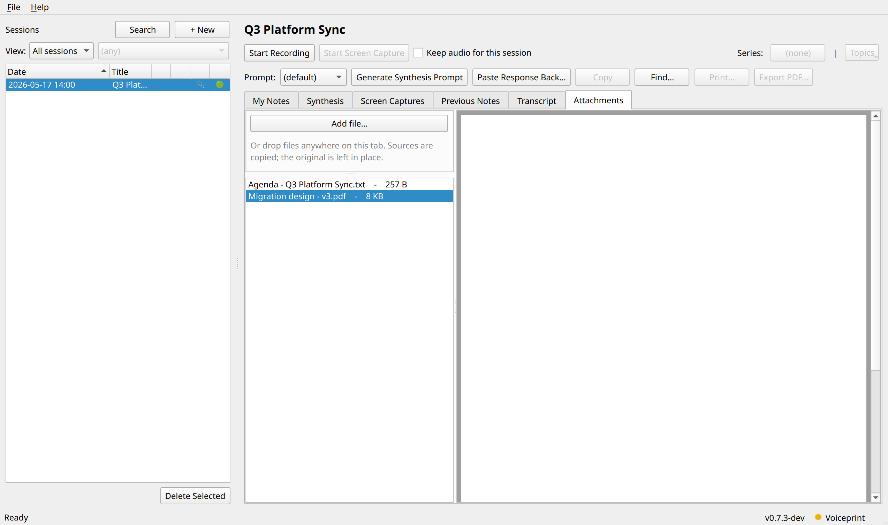

- **Export full session:** right-click a session and choose
  *Export full session...* to bundle everything into a single
  ZIP: PDFs of My Notes + Synthesis, plain-text transcript, MP3
  audio, MP4 video (if screenshots present), every attachment,
  every screen capture. When highlights exist you pick once
  between Full / Highlights-only / Both for the audio + video
  files. Suggested filename uses the session timestamp + title
  so files sort chronologically in Explorer.

## What's in v0.6.5

- **On-device transcription** via faster-whisper (CPU, int8). Runs
  live during the meeting (optional) and refines after Stop.
- **Mic + system-audio capture** through WASAPI loopback. Both WAVs
  are now wall-clock-aligned at the recorder level -- mid-recording
  silence on the system side (WASAPI engine sleeps when nothing
  plays) is filled with silence so the two streams stay synced for
  transcription, playback, and export.
- **Screen capture.** Draw a region once at the start of a recording
  and snapshot it on demand or every N seconds (with perceptual-
  hash dedup so only meaningfully different captures are kept).
  Right-click any thumbnail to Copy / Open / Delete.
- **Retain + play back recorded audio.** Recordings are encoded to
  Opus (best size) / FLAC (lossless) / WAV after the meeting. In-
  app Play button drives the recording through a transcript-aware
  player: the active line highlights as audio progresses; click a
  line to seek; the Slides tab auto-advances to the matching
  screenshot.
- **Export recording** to MP3 / FLAC / AAC / Opus / WAV (mixed
  mic + sys, single file) via right-click on the session list.
- **Export session as video.** Right-click a session to render an
  MP4 slideshow: H.264 1080p / 30 fps video, AAC mono audio,
  letterboxed screenshots that advance at their captured timestamps,
  plus a sidecar SRT subtitle file built from the transcript
  (toggleable on or off in any standard player).
- **Transcript playback layout** defaults to 70% screenshot / 30%
  transcript when playing; drag the divider to resize and the new
  ratio is remembered for future sessions.
- **Clipboard-mediated synthesis** (default) **or Chrome-extension
  automation** that drives Claude.ai end-to-end for you.
- **Speaker identification** using SpeechBrain ECAPA-TDNN
  embeddings clustered against a local library that grows as you
  label voices.
- **Outlook calendar awareness** + **ad-hoc meeting detection** for
  pre-filled session creation.
- **Live notes alongside the transcript** with Markdown editing,
  image paste, and merge-into-synthesis.
- **PDF export + printing** with embedded images preserved.
- **Crash-resilient** + **self-updating** (weekly GitHub release
  check + Help > Upgrade downloads and silently runs the latest
  installer for installer-managed installs; source / portable
  installs are told to upgrade via the user's own workflow).

## Why this exists

Many workstations forbid:

- Sending audio or transcript content out to an external API.
- Synthesizing via any LLM other than an approved one.

SaaS meeting-note tools (Granola, Otter, Fireflies, and similar)
generally violate one or both. This app moves transcription
on-device and keeps the synthesis step either fully manual (paste
the prompt, paste the response back) or controlled by a Chrome
extension that uses your existing browser session with the LLM --
the user is always the explicit transport between the local
transcript and the LLM provider. No audio, no transcript, no API
keys ever leave the machine.

---

# User Guide

This section walks through everyday use. Technical internals (how
the recorder aligns the two streams, how the Chrome bridge works,
etc.) live in [Technical Details](#technical-details) below.

## Requirements

- Windows 10 / 11 (the WASAPI loopback capture is Windows-only).
- A working microphone and a default speaker / output device.
- ~500 MB of disk for the default `small.en` Whisper model. The
  model downloads on first run.
- **For optional synthesis automation:** Google Chrome on the same
  machine. The automation feature opens a Claude.ai tab in your
  existing Chrome session and reads the response back via Chrome's
  clipboard API.

> **Microsoft Store Python is unsupported** (dev install only).
> Microsoft Store Python runs in a UWP AppContainer sandbox that
> blocks microphone access at the OS level. The app detects this
> at startup and shows a warning dialog. Use
> [python.org](https://www.python.org/downloads/) instead.

## Installation

### Windows installer (typical user path, v0.6.6+)

Download `meeting-notetaker-setup-X.Y.Z.exe` from the [latest
release](https://github.com/aarondodd/meeting-notetaker/releases/latest)
and run it. The installer:

- Installs per-user by default (no admin required); the UAC dialog
  lets you elevate for a Program Files install if you prefer
- Creates a Start Menu shortcut + optional desktop shortcut
- Registers with Add/Remove Programs for clean uninstall
- Subsequent versions self-upgrade silently (Help > Upgrade or the
  weekly background check) by downloading the new installer and
  re-running it in place

### Build locally (Windows)

```powershell
.\build.ps1                         # produces dist\meeting-notetaker\meeting-notetaker.exe
.\dist\meeting-notetaker\meeting-notetaker.exe
```

The executable bundles the Python runtime, PyQt6, faster-whisper,
and PyAV. The Whisper model itself is downloaded on first run into
`%APPDATA%\MeetingNotetaker\models\`.

### From source (dev)

```powershell
# Windows PowerShell
.\install-deps.ps1                  # creates .venv, installs everything
.\.venv\Scripts\Activate.ps1
python main.py
```

```bash
# Linux / macOS
./install-deps.sh
source .venv/bin/activate
python main.py
```

## Recording a meeting

The main window splits a session list (left) and a per-session
view (right). Recording controls sit above five tabs: **My Notes**
(your running buffer), **Synthesis** (the LLM-generated note),
**Slides** (captured screenshots), **Previous Notes** (archived
prior synthesis runs), and **Transcript** (live + final
transcription).


The session list has two narrow indicator columns to the left of
each title: a speaker icon if the audio recording is still on
disk, and a state dot (red while recording, yellow during the
post-Stop refinement pass, green when refined). Hover any cell to
see what that column conveys.

### The flow

1. **File -> New Session...** (or `Ctrl+N`). Enter a title.
   Optionally tick "Keep the audio recording after transcription"
   to retain the WAV files for this session. When Outlook is
   reachable, a **Pick from Calendar...** button appears so you
   can pre-create a session for an upcoming meeting:

   

   

2. Select the new session in the list. Click **Start**. The tray
   icon turns red and pulses.
3. The transcript pane fills with lines labeled `Me:` (your mic)
   and `Them:` (system audio), interleaved by time. (Live
   transcription is off by default in v0.6.5 -- toggle it in
   Settings if you want lines arriving in real time during the
   meeting.)
4. **Stop** when the meeting ends. The tray shows a purple
   "processing" dot while the final transcription pass runs. When
   it finishes the tray returns to blue and the transcript view
   shows the refined final transcript.
5. Switch to the **Synthesis** flow. Either:
   - **Manual:** click **Generate Synthesis Prompt**, paste into
     your chatbot, paste the response back.
   - **Automated (with the bundled extension installed):** click
     **Send to Claude.ai**.

   See [Synthesis automation](#synthesis-automation) below for the
   automated path.

## Taking notes in parallel (My Notes)

The **My Notes** tab is an editable Markdown buffer that lives
next to the transcript. A small toolbar above the editor handles
common formatting (Bold / Italic / Headings / Lists / Code /
Image / HR / Preview toggle).


Click **Preview** in the toolbar to render the Markdown in place:


Open a new session and the editor is pre-seeded with:

```
# Attendees
-

# Agenda

# Notes

# Action Items
```

Everything you type auto-saves continuously (no Save button).
Names from the `# Attendees` bulleted list are parsed out
separately and passed into the synthesis prompt as
`{{attendees}}`, so action-item owners come from the people who
were actually in the meeting.

**Image paste.** Paste an image from the clipboard (or click
**Image** in the toolbar to insert a file) and the app copies it
into the session's `images/` folder and inserts a Markdown
reference. The Preview pane renders these inline.

## Screen capture

The Screen Capture feature snapshots a region of your screen on
demand or every N seconds. Use it during shared-screen meetings
to keep visual context with your notes.

### Manual flow

1. While recording, click **Start Screen Capture** in the
   controls row.
2. A translucent overlay appears across all monitors. Drag to
   draw the region you want to capture (typically the
   shared-screen area in Teams / Zoom).
3. A thin cyan outline persists around the armed region for the
   duration of the recording so you can see what will be
   captured.
4. In the **My Notes** tab's right sidebar, the Capture and
   Insert buttons are now enabled.
5. Click **Capture** to snapshot the region into the session's
   `screenshots/` folder. Click **Insert** to do the same AND
   drop a markdown image-ref at the cursor in My Notes.

### Auto-capture

Tick the **Auto-capture** checkbox in the same sidebar. While
armed, the region is snapshotted every N seconds (default 30,
set in Settings). Each fresh capture's perceptual dHash is
compared against the most-recently-kept image; near-duplicates
are discarded. Only meaningfully-different content sticks
around. Manual Capture / Insert clicks always keep their image
(no dedup check) and update the dedup baseline.

### Viewing captured slides

The **Slides** tab lists every captured screenshot as a
thumbnail grid:

- **Click a thumbnail** -- switch to full-image view with
  Previous / Next / Back navigation.
- **Right-click** -- Copy image to clipboard / Open in default
  viewer / Delete.

While **playback** is active (see below), the Slides tab
auto-advances to track the recording position; clicking a
thumbnail seeks the audio to that screenshot's recording-relative
timestamp.

## Playing back the recording

If you kept the audio (checkbox in New Session, or default in
Settings), the **Transcript** tab grows a slim Play / Stop +
scrubber + time-readout bar at the bottom.

- **Click Play** -- the recording plays back. The active
  transcript line highlights as audio progresses.
- **Click a transcript line** -- the audio seeks to about 10
  seconds before that line's timestamp and continues playing
  from there. The clicked line stays highlighted until playback
  catches up to it.
- **Drag the scrubber** -- seek to any moment.
- **Stop** -- pause where you are. The next Play resumes from
  the same spot.

If the session also has captured screenshots, hitting Play (or
clicking any transcript line while paused) swaps the Transcript
tab to a screenshare-style layout: the matching screenshot shows
up top, the transcript scrolls below. As playback crosses each
captured screenshot's recording-relative timestamp, the top image
updates. The split defaults to 70% screenshot / 30% transcript;
drag the divider to resize and the new ratio is remembered for
future sessions. Pausing keeps the layout up; only natural end of
playback returns to the full-width transcript view.

The Slides tab also gets its own Play bar that drives the same
player.

## Exporting the recording

Right-click any session with a retained recording in the session
list:

- **Open recording in media player** -- launches your OS default
  player on the source file.
- **Export recording as...** -- opens a save dialog with filter
  options for MP3 (default, most universal), FLAC, AAC, Opus, or
  WAV. Both source streams (mic + sys) are mixed into a single
  file at the chosen format. An indeterminate progress dialog
  shows while encoding runs in a worker thread.
- **Export session as video...** -- renders an MP4 slideshow with
  the mixed audio + screenshots flipping at their captured
  timestamps. H.264 1080p / 30 fps video, AAC mono audio, black
  frames before the first screenshot, letterbox bars to preserve
  aspect ratio. A matching `.srt` sidecar carries the transcript
  as toggleable subtitles -- every standard player auto-loads the
  SRT and lets the viewer turn subtitles on or off; delete the
  SRT if you'd rather share the MP4 alone. A determinate progress
  dialog tracks per-frame encode progress.
- **Delete recording...** -- removes the audio files but keeps
  the transcript + notes.

## Synthesis: chatbot hand-off

The default flow is **manual** (clipboard hand-off). You can
optionally install the bundled Chrome extension to automate the
flow against Claude.ai.

### Manual flow

1. Click **Generate Synthesis Prompt**. A dialog opens with a
   template picker, a rendered preview of the merged prompt
   (your live notes + the transcript), and a Copy to clipboard
   button:

   

2. Paste into your chatbot of choice (Claude.ai, M365 Copilot,
   etc.). Wait for the reply.

3. Copy the response, come back to Meeting Notetaker, click
   **Paste Response Back...**, paste, save:

   

4. The **Synthesis** tab now shows the rendered response. If a
   prior notes file existed, it's auto-archived to
   `notes-YYYYMMDD-HHMM.md` and listed under **Previous Notes**.

The Synthesis tab is editable in place (Markdown source + Preview
toggle, same as My Notes), so you can polish the LLM's output
before sharing.


The **Copy** button puts the active tab's contents on the
clipboard as both Markdown and rendered HTML (with images inlined
as base64 data: URIs) for paste into Word / OneNote / Notion /
plain editors. Coverage varies by destination; see the
paste-target table in the [Technical Details](#technical-details)
section.

The **Print** and **Export PDF** buttons render the active tab
to a printer or a PDF file (with images preserved and Markdown
links clickable).

### Synthesis automation (optional)

Starting in v0.6.3, the **Settings -> Synthesis Automation**
section can replace the Generate + Paste buttons with a single
**Send to Claude.ai** button. A bundled Chrome extension drives
the chat tab for you: opens the conversation, pastes the prompt,
watches for the response to stream in, clicks Claude's Copy
button to read it back as proper markdown, then closes the tab.

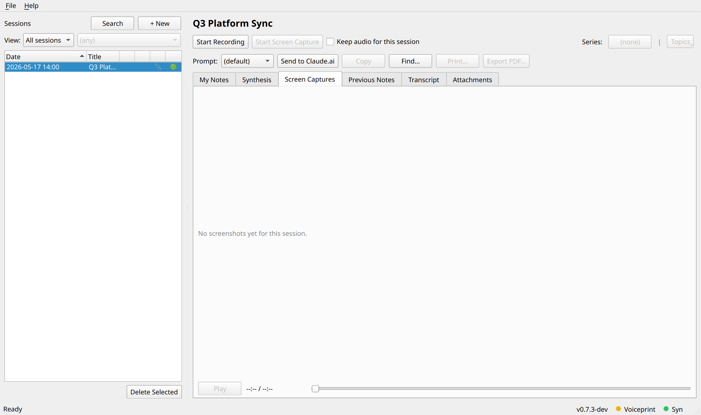

**What stays the same:**

- **No API calls.** The extension uses your existing Claude.ai
  browser session.
- **The browser remains the intermediary.** The extension types
  into the chat composer and reads the rendered response via
  Claude's own Copy button.
- **The proxy interstitial still gates traffic.** If your
  outbound proxy shows a "PROCEED" page on the first AI request,
  the extension detects it, shows a toast, and waits for you to
  click PROCEED.

**Hard dependencies:**

- Google Chrome on the same machine. The extension is Manifest
  V3 and loads as an unpacked extension.
- Windows (the native-messaging bridge registers itself in HKCU).
- A signed-in Claude.ai account.

**One-time install (Path 3: guided manual).** Chrome doesn't
permit silent install of unpacked extensions, so the install flow
is a three-step wizard launched from **Settings > Synthesis
Automation > Install / Verify...**:

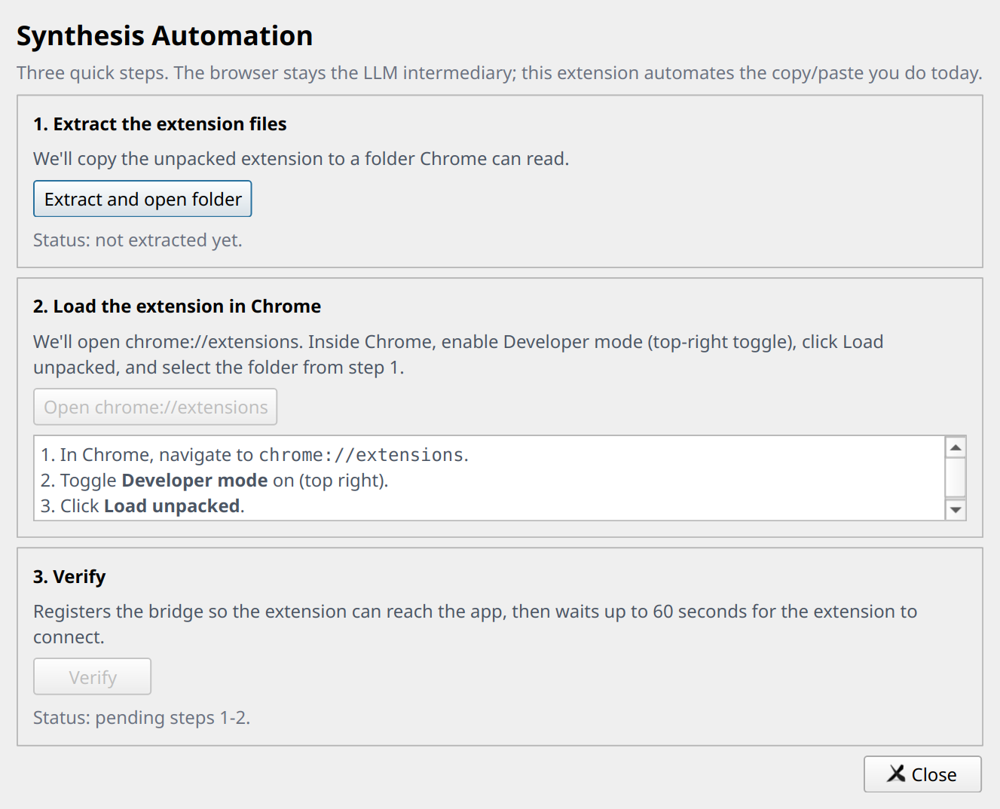

1. **Extract the extension files.** Click *Extract and open
   folder*; the app drops the unpacked extension into
   `%LOCALAPPDATA%\MeetingNotetaker\automation\extension` and
   opens it in Explorer.
2. **Load in Chrome.** Open `chrome://extensions`, toggle
   Developer mode on, click **Load unpacked**, select the
   folder.
3. **Verify.** Back in the wizard, click *Verify*. The app
   registers the native-messaging bridge in HKCU and waits up
   to a minute for the extension to connect.

**Chrome permissions you'll be asked to grant.** On the first
synthesis, Chrome shows a one-time per-site prompt asking the
extension to access the clipboard for `claude.ai`. Click
**Allow**. The extension uses Claude's own Copy button + the
Clipboard API to read the response back as markdown.

**Status bar.** The **Syn** pill in the status bar carries the
connection state in its dot color: green = connected, yellow =
Chrome cold (Send will launch it), red = disconnected. Hover for
the full description.

**Optional: route into a Claude project.** Paste a project UUID
into **Settings > Synthesis Automation > Claude project ID** and
every Send goes into that project instead of the default chat
list.

**Per-session prompt template.** The synthesis tab has a
**Prompt** dropdown that picks which template (default,
one-on-one, standup, or any custom file in
`%APPDATA%\MeetingNotetaker\prompts\`) to use for that session.
Selection persists across app restarts.

## Speaker identification

After each recording, the app tries to label the *system audio*
side of the transcript with real names ("Alice:", "Bob:") instead
of the generic "Them:". It learns who is who over time -- the
first meeting with a new colleague needs one quick labeling pass;
subsequent meetings recognize that voice automatically. All
processing is on-device.

### What you'll see

If any voice in the recording didn't match the speaker library,
the **Label Unknown Speakers** dialog pops automatically after
the post-meeting pass. Each card shows the top example transcript
lines for that cluster plus a name field that autocompletes from
Outlook attendees and known speakers:


After the fact, **Review Speakers** (button on the session view)
walks every detected speaker and lets you rename / forget /
confirm:


The speaker library lives at
`%APPDATA%/MeetingNotetaker/speakers.db`. Open via **Settings >
Manage Speakers...**; Rename / Forget per row, with a Forget All
escape hatch:


### Tips for accuracy

The library starts empty. It grows as you label voices, and the
running-average centroid update tightens each stored embedding
with every confirmation.

- **Label voices the first time you see them.** Use a consistent
  form (`Alice Smith` every time, not `Alice` sometimes) -- the
  store keys on the exact string.
- **Skip what you don't recognize.** A bad label trains the
  wrong embedding into the store.
- **Use Review Speakers when something looks wrong.** Rename
  pushes the centroid update to the *new* name; the old name's
  record is unchanged (Forget it manually via Manage Speakers if
  it's corrupted).
- **Lean on the Outlook attendee list.** Calendar-pre-filled
  sessions have attendee names ready in the name combo box.

Both the merge threshold (within-meeting clustering) and the
match threshold (cross-meeting recognition) are tunable in
Settings; see the [Tuning diarization
thresholds](#tuning-diarization-thresholds) subsection below.

## Settings reference

Open via **File -> Settings...** (`Ctrl+,`) or the tray menu. All
of these are also editable directly in `config.toml`.


| Setting | Default | What it does |
|---|---|---|
| Your name | (empty -> "Me") | Replaces "Me:" in the transcript display and in the synthesis prompt. When set, the LLM sees your real name and assigns action items by name instead of "TBD". |
| Model size | `small.en` | Which faster-whisper model to use. See [Choosing a model](#choosing-a-model). |
| Capture-only mode | **on** | Skip live transcription; run a single Whisper pass when you click Stop. v0.6.5+ default. Lower CPU during the meeting. Per-session override available in the New Session dialog. |
| Skip post-Stop refinement | off | Make the live transcript final. No second Whisper pass after you click Stop. |
| High accuracy mode | off | Off = greedy decoding (beam_size=1); on = beam_size=5 (slower, slightly more accurate). |
| CPU threads per worker | 0 (auto) | CTranslate2 `cpu_threads`. 0 derives from `cpu_count() / num_workers`, minimum 2. |
| Parallel workers | 2 | CTranslate2 `num_workers`. Lets independent transcribe() calls run truly in parallel. |
| Retain audio (default) | off | Default state of the "Keep recording" checkbox for new sessions. |
| Retained format | Opus | Opus / FLAC / WAV. Opus trims a 1-hour meeting from ~1 GB to ~45 MB with no practical speech-quality loss. |
| Auto-capture interval | 30 s | Cadence for the screen-capture auto-mode (5-300 s range). |
| Auto-capture dedup threshold | 10 bits | Sensitivity for the dHash-based duplicate filter (0-32, of 64 bits). |
| Enable VAD | on | Trim silent stretches before Whisper decodes them. |
| VAD min silence (ms) | 500 | How quiet a stretch has to be (in ms) before VAD treats it as silence. |
| Mic device | (System default) | Persists by name so the same device is picked after replug. |
| Loopback device | (System default) | WASAPI loopback. Windows-only. |
| Custom vocabulary | (empty) | One phrase per line in `vocabulary.txt`. Per-session hotwords also auto-derived from `# Attendees` + agenda. |
| Watch Outlook calendar | off | Poll Outlook for upcoming meetings. Click a tray notification to open New Session with the meeting subject + attendees + agenda pre-filled. |
| Notify within (min) | 5 | How far in advance to surface the calendar notification. |
| Detect ad-hoc meetings | off | Watch the Windows audio mixer for sustained audio from a known meeting app (Teams, Zoom, ...). |
| Enable speaker identification | on | Run the post-meeting clustering pass. Disable to keep generic "Them:" labels. |
| Match threshold | 75% | Cosine-similarity floor for matching a meeting voice against a stored speaker. |
| Merge threshold | 75% | Cosine-similarity floor for merging two clusters into one during the agglomerative pass. |
| Manage Speakers... | -- | Opens the speaker-library editor. |

---

# Technical Details

This section is for understanding how the pieces fit together (for
debugging, contributing, or just curiosity). Day-to-day use only
needs the User Guide above.

## Architecture overview

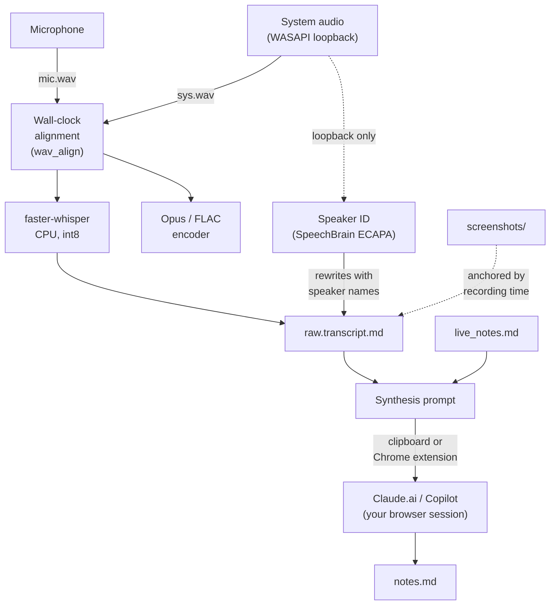

The WASAPI loopback path is adapted from
[Danaor/WhisperType](https://github.com/Danaor/WhisperType).

## Recording pipeline

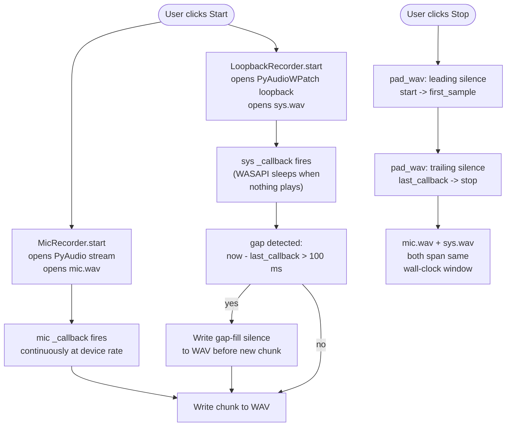

The load-bearing piece for keeping mic.wav and sys.wav aligned is
wall-clock-driven WAV padding. WASAPI loopback doesn't deliver
samples when the Windows audio engine is asleep (nothing playing
through the speakers), so without intervention sys.wav would be
shorter than mic.wav and the system-audio content would land at
the wrong moment in playback / transcription. Three places fix
this:

1. **First-sample delay** -- between `start()` and the first
   callback, no samples arrive. At stop, `pad_wav` prepends
   silence to cover that window.
2. **Mid-recording gaps** -- if WASAPI stops firing callbacks
   during a silent stretch, the next callback's wall-clock delta
   exceeds the frame time. The recorder writes the missing
   silence into the WAV before the new chunk.
3. **Trailing dropout** -- after the last callback and before
   `stop()` is called, no samples arrive. At stop, `pad_wav`
   appends silence to fill.

After all three pads, mic.wav and sys.wav both span exactly
`[start_wallclock, stop_wallclock]` with audio in the right
positions. Everything downstream (transcription, encoder, player,
export) sees naturally-aligned files.

### Audio retention

If the user kept "Retain audio" for the session, after the batch
transcription pass commits, the WAVs are re-encoded to the
configured format (Opus / FLAC / WAV) and the WAVs are deleted.

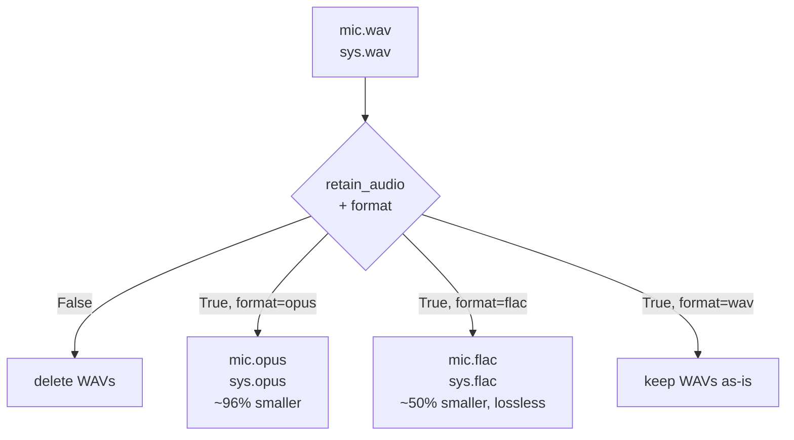

Each encode preserves the wall-clock alignment from the source
WAV (PyAV decode + resample writes the same duration out the
other side).

## Transcription

Two Whisper passes can run for every recording (one or both,
depending on Settings):

- **Live transcription**, while recording (off by default in
  v0.6.5). Each source (mic + system audio) runs as its own
  background worker, popping 10-second windows with 5-second
  overlap from a ring buffer. Each window is decoded as it
  arrives.
- **Batch refinement**, after Stop. The full mic + sys WAV files
  are re-transcribed end-to-end so Whisper has the entire
  context to lean on. Quality is slightly higher (better
  punctuation, fewer split sentences). On CPU this is roughly
  **real-time** -- a 30-minute meeting on `small.en` takes ~30
  minutes of CPU to refine.

You don't have to wait for the refinement pass before
synthesizing. The status label switches from "Recording" to
**"Refining transcript -- you can synthesize now"** the moment
Stop completes; Generate / Paste / Send are immediately
available. Anything you do during refinement uses the live
transcript; if you re-generate after refinement finishes, the
better version is used automatically.

### Choosing a model

| Size | Disk | Quality | Notes |
|---|---|---|---|
| `tiny.en` | ~75 MB | Low | Useful only if your CPU is very slow or you just need keyword-level signal. |
| `base.en` | ~145 MB | OK | A reasonable smaller default. |
| `small.en` | ~480 MB | Good | Recommended for real meetings. |
| `medium.en` | ~1.5 GB | Best | ~3x slower than small.en. Use for high-stakes recordings if you have CPU headroom. |

### Speaker identification pipeline

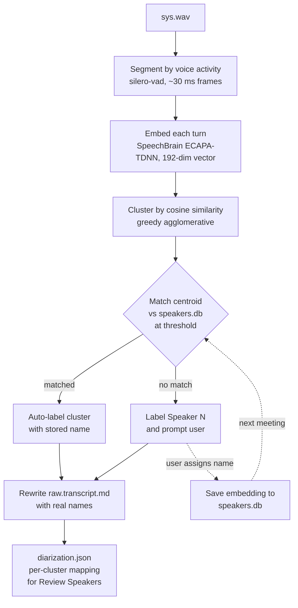

The mic channel is always the user; it doesn't go through this
pipeline and keeps its `{{user_name}}:` / `Me:` rendering.

After Stop, the controller chains:

1. **Final transcription** (the batch pass; rewrites the live
   transcript with a cleaner version).
2. **Voice segmentation** on `sys.wav`: silero-vad chops the
   loopback channel into per-turn voiced spans (typical meeting:
   30-200 turns). Falls back to webrtcvad and then an energy
   threshold if silero / torch can't load.
3. **Embedding**: SpeechBrain's ECAPA-TDNN produces a 192-dim
   vector per turn. Voiced turns shorter than 1.0 s are skipped
   because short-clip embeddings are unreliable.
4. **Clustering**: greedy agglomerative cosine merge collapses
   turns into per-speaker clusters (Merge threshold tunable).
5. **Matching**: each cluster centroid is compared against every
   name in `speakers.db`. Above the threshold, the cluster
   auto-labels with the stored name.
6. **Transcript rewrite**: `raw.transcript.md` is rewritten with
   the resolved names where matched, `Speaker N` fallback where
   not.
7. **`diarization.json` saved** alongside the transcript so the
   Review Speakers walker works on this session forever, even
   after `sys.wav` is cleaned up.
8. **Unknown-speaker dialog**: if any cluster didn't match, the
   Label Unknown Speakers dialog pops with example transcript
   lines per cluster.

### Limits of the diarization

This is a small CPU-only model running on recorded audio. It is
good at distinguishing two or three clearly-different voices in a
quiet meeting. It struggles with:

- **Overlapping speech.** Cross-talk produces a turn with mixed
  embeddings; the cluster goes somewhere ambiguous.
- **The same person on different microphones.** A colleague who
  joins one meeting from a headset and another from a phone
  speaker may not match across meetings. The match threshold is
  the knob; loosening it improves recall on this case at the cost
  of more false matches.
- **Very short utterances.** A "thanks" or "agreed" turn under
  half a second gets dropped by the segmenter.
- **Channel changes.** Different Teams / Zoom audio paths,
  bluetooth-vs-USB, codec changes, or aggressive noise
  suppression can shift the embedding enough to miss a match.

### Tuning diarization thresholds

The two knobs in Settings (default 75% each) control different
stages of the speaker-identification pipeline.

**Merge threshold** -- governs clustering *within* a single
meeting:

| Symptom | What to do | Try first |
|---|---|---|
| Four people show up as 20+ "Speaker N" clusters. | Lower the merge threshold. | **0.60**, then 0.55 |
| Two distinct people keep merging into one cluster. | Raise the merge threshold. | **0.80**, then 0.85 |

Over-splitting is the more common failure mode, so try
**lowering merge first** if unsure.

**Match threshold** -- governs *cross-meeting* recall against
`speakers.db`:

| Symptom | What to do | Try first |
|---|---|---|
| A labeled colleague keeps coming back as "Speaker N". | Lower the match threshold. | **0.70**, then 0.65 |
| A cluster gets auto-named with the wrong stored speaker. | Raise the match threshold. | **0.80**, then 0.85 |

Both thresholds are saved to `config.toml` and take effect on
the *next* speaker-identification pass.

## Screen capture

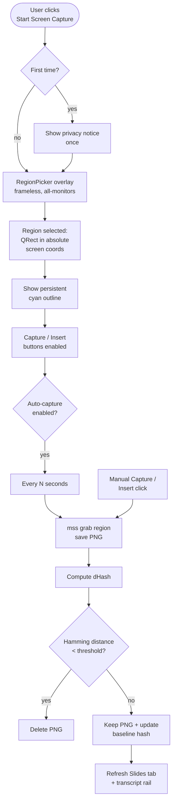

Screenshots land in `<session>/screenshots/NNNN-YYYYMMDDTHHMMSSZ.png`
where NNNN is a monotonic sequence number. During playback (or
when the user clicks a transcript line while paused), the
Transcript tab swaps to a vertical split (image on top,
transcript below) with the active image following the
sticky-latest rule (the most recent screenshot whose offset
&lt;= current playback position). The split defaults to 70/30 top
versus bottom; the user can drag the divider and the new ratio
persists to `config.toml` (`ui.transcript_playback_split_top_pct`).

The **Slides** tab has its own player bar that mirrors the
Transcript tab's bar; both bars reflect a single AudioPlayer
state. Clicking a thumbnail in the Slides tab while audio is
loaded seeks the player to that screenshot's recording-relative
timestamp.

## Synthesis automation deep-dive

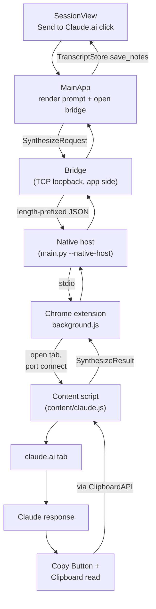

The Chrome extension is Manifest V3 with a deterministic key
(`gmnecenhibfigbpldhacjhgmooopeelo`) hard-coded as
`installer.EXTENSION_ID`. The bundled extension lives at
`meeting_notetaker/resources/extension/`; the installer copies
it to `%LOCALAPPDATA%\MeetingNotetaker\automation\extension`
and registers the native-host manifest in HKCU.

The bridge is a single-peer TCP loopback server. Each app launch
rotates the handshake token in
`%LOCALAPPDATA%\MeetingNotetaker\automation\bridge.json` so a
stale handshake from a crashed prior run can't authenticate.

The content script's response detector uses Claude's stop-button
toggle to know when generation has finished, then clicks Claude's
own Copy button and reads the clipboard. This is resilient to
class-name churn in Claude's DOM and survives most UI updates.

## Audio playback + transcript sync

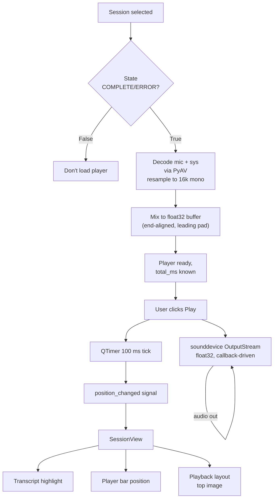

Each stream gets a generation id (monotonic counter) so a queued
finished_callback from a previously-stopped stream can't tear
down a newer one. This is the load-bearing piece for click-to-
seek during playback: `seek_ms` synchronously stops the old
stream and starts a new one; without the generation check, the
old stream's queued callback would close the new stream and stop
the position tick.

On buffer drain, the audio callback raises
`sounddevice.CallbackStop`, the stream tears down cleanly, and
the next play() builds a fresh stream from scratch.

## Storage layout

```
%APPDATA%\MeetingNotetaker\
  sessions.db                    # SQLite session + folder metadata (WAL)
  speakers.db                    # SQLite speaker library
  config.toml                    # user settings
  instance.lock                  # single-instance pidfile
  meeting_notetaker.log          # rotating app log
  models\                        # faster-whisper model cache
  prompts\                       # user-editable synthesis prompts
  vocabulary.txt                 # user-editable global hotwords
  automation\                    # synthesis-automation install state
    extension\                   # unpacked Chrome extension
    bridge.json                  # per-launch handshake token
  sessions\
    <session-uuid>\
      raw.transcript.md          # interleaved transcript, source-labeled
      live_notes.md              # your own running notes
      notes.md                   # latest LLM-generated notes
      notes-YYYYMMDD-HHMM.md     # archived prior notes
      diarization.json           # per-cluster speaker mapping + centroids
      metadata.json
      audio\                     # mic + sys WAV / Opus / FLAC
      images\                    # images pasted into live_notes / notes
      screenshots\               # captured screenshots (NNNN-<ts>Z.png)
```

## Performance tuning

If the refinement wait bothers you:

- **Smaller model.** `base.en` is roughly 3x faster than
  `small.en` for both live and batch passes.
- **Skip post-Stop refinement.** Settings -> Skip post-Stop
  refinement = on. No CPU cost after Stop; the live transcript
  is final.
- **Tune CT2 manually.** The defaults assume the app should auto-
  pick threads + workers from your physical core count. If you'd
  rather drive it yourself, the `CPU threads per worker` +
  `Parallel workers` settings give you direct control. Total OS
  threads = `threads * workers`; keep that product at or below
  your physical core count to avoid oversubscription.
- **Retain the audio.** Per-session "Keep audio" toggle keeps
  the source files. If you ever want to re-run Whisper with a
  different model or settings, the source is there.

Two-source recordings get a free 2x speedup on the refinement
pass: both sources run in parallel on different CPU cores.
Single-source recordings (mic only) get no benefit.

## Synthesis prompts

Bundled prompts seed `%APPDATA%\MeetingNotetaker\prompts\` on
first run:

- `default.md` -- generic meeting (Attendees / Agenda / TL;DR /
  Decisions / Notes / Action Items / Open Questions / Verbatim
  Quotes; merges live notes with transcript)
- `one-on-one.md` -- 1:1 retrospective shape (topics, commitments
  by side)
- `standup.md` -- yesterday / today / blockers per speaker

**Adding your own prompts.** Drop any `*.md` file into the
prompts directory. It appears in the template picker. Filename
(sans extension) becomes the display name; `my-team-retro.md`
shows as "My Team Retro".

**Placeholders:**

| Placeholder | What it expands to |
|---|---|
| `{{session_title}}` | The session's title |
| `{{date}}` | The session's creation date (`YYYY-MM-DD HH:MM`) |
| `{{transcript}}` | The full transcript body. |
| `{{live_notes}}` | The body of the My Notes tab. |
| `{{attendees}}` | Comma-joined list of names from `# Attendees` bullets. |
| `{{user_name}}` | The value of the "Your name" setting. Empty -> `Me`. |

**Upgrading.** Bundled prompts get new revisions across releases.
If you haven't edited a template (its on-disk body matches the
version that shipped with a prior release), the app refreshes it
automatically on startup. Any prompt you've actually edited is
never touched.

## Paste-target coverage for Copy

The Copy button on the **My Notes** and **Synthesis** tabs puts
two payloads on the clipboard at once: the raw Markdown source
(for plain-text editors) and a rendered HTML version with each
embedded image inlined as a `data:image/...;base64` URI (for
rich-text paste targets). Different destinations pick different
sides:

| Destination | Formatting | Images | Notes |
|---|---|---|---|
| Word (desktop) | yes | yes | Best target. |
| OneNote (desktop) | yes | yes | Same as Word. |
| Outlook (desktop, compose) | yes | yes | Same as Word. |
| Notion (web) | yes | yes | Notion re-uploads each data: URI to its own CDN on paste. |
| Outlook Web (compose) | yes | **no** | Microsoft's web sanitizer strips data: URIs. Formatting survives. |
| Microsoft Teams (desktop, compose) | yes | **no** | Same sanitizer. |
| Gmail (web compose) | yes | usually no | Browser-paste sanitizer varies. |
| VS Code / Obsidian / plain editors | -- | -- | Take the Markdown side unchanged. |

The image-loss is by Microsoft's deliberate XSS protection in the
web-paste pipeline. Workaround: paste the message text first,
then right-click the image in My Notes preview, **Copy Image**,
paste into Teams / OWA as a second step.

---

# Reference

## Updates

The Help menu has **Check for Updates...** (manual) and
**Upgrade...** (download + rebuild + install in place via
pyinstaller). On startup the app runs a silent weekly check
against GitHub releases for `aarondodd/meeting-notetaker`; if a
newer tag exists you see a prompt.

The Upgrade flow:

1. Downloads the release zipball and extracts it to a temp dir.
2. Runs `build.ps1` (Windows) or `build.sh` (POSIX).
3. Copies the freshly built `dist/meeting-notetaker.exe` over
   the running executable. The old binary is renamed to
   `meeting-notetaker.exe.old`.
4. Offers a **Restart now?** prompt.
5. On the next startup, the old `.exe.old` sibling is cleaned
   up automatically.

## Network and privacy

The app makes exactly one kind of outbound network call:
downloading model files from `huggingface.co` on first run (the
faster-whisper model and the ECAPA-TDNN speaker encoder). After
that, no network. All other paths (clipboard hand-off, file I/O,
transcription, speaker identification, screen capture, playback)
are on-device.

### Corporate proxies (Netskope, Zscaler, etc.)

If your workstation routes through a MITM proxy that re-signs
TLS, the first-run model download will fail with
`CERTIFICATE_VERIFY_FAILED` even though Edge / Outlook / npm all
work. Python's `httpx` (used by `huggingface_hub`) doesn't see
the corporate CA -- it has its own bundled trust list.

The app ships `truststore` (Windows only, in `requirements.txt`)
and injects it at startup. `truststore` makes Python's `ssl`
module use the OS certificate store, which already trusts the
corporate CA.

If `truststore` isn't enough (e.g. the proxy uses pinning),
pre-stage the models offline:

1. On a machine that can reach `huggingface.co`, download the
   model files. Easiest: `pip install faster-whisper` in a
   clean venv and run
   `python -c "from faster_whisper import WhisperModel; WhisperModel('small.en')"`,
   then copy the snapshot directory to a thumb drive.
2. On the work machine, drop the model files into
   `%APPDATA%\MeetingNotetaker\models\small.en\`. That directory
   should contain `model.bin`, `config.json`, and either
   `tokenizer.json` or `vocabulary.txt`.
3. Start the app. The model manager detects the local snapshot
   and never calls Hugging Face.

You can also set `HF_HUB_OFFLINE=1` in the environment to force
offline mode against the standard Hugging Face cache layout
(`models--Systran--faster-whisper-<size>/`). Either approach
works.

The ECAPA-TDNN speaker encoder follows the same pattern;
pre-stage its `<app_data>/models/ecapa/` directory if you can't
reach Hugging Face on the work machine.

## License

MIT. See [`LICENSE`](LICENSE).
