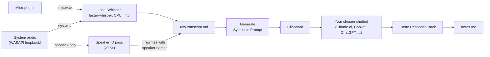
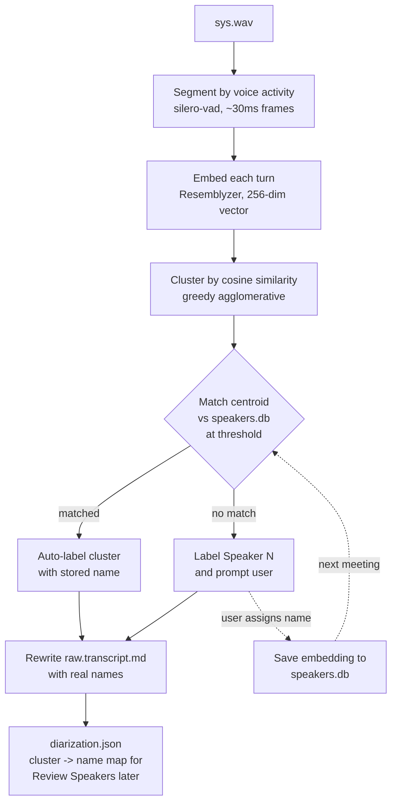

# Meeting Notetaker

Local meeting capture for Windows. Records your microphone and the system
audio (whatever's playing through your speakers, including Teams / Zoom /
Meet calls), transcribes both streams locally with faster-whisper, and
hands the resulting transcript to you for synthesis by any LLM you trust,
via clipboard. No audio leaves the machine; no API key required.



## Screenshots

The main window splits a session list (left) and a per-session view (right).
Recording controls sit above four tabs: the live transcript, your own notes,
the synthesized result, and any earlier synthesis runs archived for the
same session.

**Transcript -- interleaved mic + system audio, timestamped per line.**
Your microphone is labeled with the name you set in Settings (`John` in
the example below); the other side of the call is labeled `Them`.


The session list has two narrow indicator columns to the left of each
title: a speaker icon if the audio recording is still on disk, and a
state dot (red while recording, yellow while the post-Stop refinement
pass is running, green when refined). Hover any cell to see what that
column conveys.

**My Notes -- your running buffer alongside the transcript.** Markdown
source with a small formatting toolbar. Sections (`# Attendees / # Agenda
/ # Notes / # Action Items`) auto-seed on first open. Everything you
type auto-saves continuously and is fed back into the synthesis prompt.
Paste an image from the clipboard (or click **Image** in the toolbar to
insert a file) and the app copies it into the session's `images/` folder
and inserts a Markdown reference -- ideal for screenshares.


Click **Preview** in the toolbar to render the Markdown source in place:


**Synthesis -- the response from your chatbot, editable in place
(v0.5+).** Populated after you click *Paste Response Back* with the
LLM's reply. The tab is a Markdown editor with the same Preview /
Edit toggle as My Notes, so you can tweak the generated note before
sharing -- the previous read-only view was a tell that the field was
mostly correct but never exactly what we wanted. The **Print...**
button above the tabs sends the active tab to a physical printer.
For a PDF copy use **Export PDF...** -- it writes a PDF directly via
Qt's PDF backend, which preserves images and clickable links (the
Windows "Print to PDF" driver rasterizes both away). The **Copy**
button copies whichever tab is currently active (its label updates
to match: "Copy Transcript", "Copy My Notes", "Copy Synthesis").


**Previous Notes -- earlier synthesis runs, kept as an audit trail.** Any
time you paste a new response, the prior `notes.md` is archived to
`notes-YYYYMMDD-HHMM.md` and listed here.


### Dialogs

**New Session** -- title plus a per-session "Keep recording" override.
When Outlook is reachable, a **Pick from Calendar...** button appears so
you can pre-create a session for an upcoming meeting:


**Pick from Calendar** -- lists today's remaining meetings; select one
to pre-fill the session title (still editable) and queue the attendees
+ agenda for the new session's My Notes:


**New Session pre-filled from an Outlook calendar invite** -- click the
"Meeting starting" tray notification and the dialog opens with the
meeting subject already entered; attendees + agenda land in My Notes
when you accept:


**Ad-hoc meeting detection** -- opt-in setting (Settings > Detect ad-hoc
meetings) that watches the Windows audio mixer via pycaw for an active
session from a known meeting app (Teams, Zoom, Slack, WebEx, ...). When
audio sustains long enough to look like a call rather than a notification
chirp (configurable, default 25s), a tray toast offers to open New Session
pre-filled with the app name and timestamp. Recording never auto-starts.
No audio is captured -- the OS already exposes which apps are playing; we
read the metadata, not the stream.

**Settings** -- model size, capture / refinement toggles, custom
vocabulary, audio device picker, Outlook calendar watch, ad-hoc meeting
detection, VAD, your name, and a shortcut to the prompt-templates folder. The dialog
scrolls if your screen is short. The interface follows the OS
dark/light setting automatically -- there is no separate theme
picker.


**Generate Synthesis Prompt** -- pick a template, preview the rendered
prompt, copy to clipboard. The preview shows the live transcript merged
with your notes and the attendee list parsed from `# Attendees`:


**Paste Response Back** -- paste the LLM's reply; on Save the prior
notes file is auto-archived (toggle controls whether):


**Label Unknown Speakers (v0.5+)** -- pops automatically after the
post-meeting speaker-identification pass if any voice in the
recording didn't match the speaker library. Each card shows the
top example transcript lines for that cluster + a name field that
autocompletes from Outlook attendees and known speakers. Skip the
ones you don't recognize; confirmed names get stored so future
meetings auto-recognize the same voices:


**Review Speakers (v0.5+)** -- a button on the session view that
walks every detected speaker for after-the-fact correction. Rename
a mis-clustered speaker (Bob -> Alice), forget a wrong label, or
just confirm the existing assignments to reinforce them in the
store:


**Manage Speakers (v0.5+)** -- the speaker library lives at
`%APPDATA%/MeetingNotetaker/speakers.db`. Open via Settings >
Manage Speakers...; lists every stored name with sample count and
last-seen date, with Rename / Forget per row and a Forget All
escape hatch:


## Why this exists

Many workstations forbid:

- Sending audio or transcript content out to an external API.
- Synthesizing via any LLM other than an approved one.

SaaS meeting-note tools (Granola, Otter, Fireflies, and similar)
generally violate one or both. This app moves transcription on-device and
keeps the synthesis step manual: paste the prompt and transcript into
your approved chatbot, then paste the response back. The user is the
explicit transport between the local transcript and the LLM.

Tighter LLM integration is a future possibility, but the initial release
deliberately keeps audio on-device and routes synthesis through a human
hand-off.

## Status

v0.5 alpha. End-to-end capture + transcription + synthesis works.
v0.5 adds **post-meeting speaker identification with persistent
self-learning**: after a recording stops, the app segments the
system-audio loopback channel into per-speaker turns, embeds each
turn with Resemblyzer, clusters them, and matches the clusters
against a local speaker library (`speakers.db`). Unrecognized voices
prompt a *Label Unknown Speakers* dialog with example transcript
lines per cluster + suggestions seeded from the Outlook attendee
list -- assign once, and future meetings auto-label them. A *Review
Speakers...* button on each session walks every detected cluster
for after-the-fact corrections (rename / forget); the speaker store
gets a running-average centroid update on each confirmation so the
match quality improves over meetings. v0.5 also makes the Synthesis
tab editable in place (same Markdown editor as My Notes), so the
LLM-generated note can be tweaked before sharing.

v0.4 (kept in v0.5) brings calendar-aware capture (Outlook COM
polling -> tray notification -> pre-filled New Session), custom
vocabulary (global plus per-session hotwords from attendees +
agenda), audio-device picker, image paste / insert into My Notes,
native PDF export (Print for paper; Export PDF for files; both
preserve images and links), a "Copy" button that always copies the
active tab, a non-modal log viewer (Help > View Log), an Outlook
reachability diagnostic (Help > Diagnose Outlook), a permanent
status bar at the bottom showing input device + system-audio device
+ calendar state + speaker count, and a weekly GitHub-releases
update check (Help > Check for Updates...). The interface follows
the OS dark/light setting automatically. Performance tuning is
ongoing; the final refinement pass can take a while on CPU (see
"Why transcription can take a while" below).

The WASAPI loopback path is cribbed from
[Danaor/WhisperType](https://github.com/Danaor/WhisperType).

## Requirements

- Windows 10 / 11 (the WASAPI loopback capture is Windows-only).
- Python 3.10+ (3.11+ recommended).
- A working microphone and a default speaker / output device.
- ~500 MB of disk for the default `small.en` Whisper model. The model
  downloads on first run.

The dev environment installs PyAudio's PortAudio binding. On Windows the
pip wheel ships PortAudio binaries; no extra system install is needed.

## Install (dev)

```powershell
# Windows PowerShell
.\install-deps.ps1        # creates .venv, installs everything
.\.venv\Scripts\Activate.ps1
python main.py
```

```bash
# Linux / macOS
./install-deps.sh
source .venv/bin/activate
python main.py
```

`install-deps.ps1` / `install-deps.sh` wrap a two-step pip install:

```
pip install -r requirements-dev.txt
pip install --no-deps Resemblyzer
```

The second line avoids a known Windows build failure. Resemblyzer's
`setup.py` lists `webrtcvad` (the original PyPI package) as a hard
dependency. That package has no maintained Windows wheel for Python
3.10+, so a normal `pip install Resemblyzer` falls through to
compiling the C extension from source and fails unless you have
Microsoft Visual C++ Build Tools installed. `webrtcvad-wheels`
(already in `requirements.txt`) provides the same `webrtcvad`
*import* but pip resolves by PyPI name, so it can't satisfy
Resemblyzer's requirement automatically. Installing Resemblyzer with
`--no-deps` skips the resolution step; its other transitive deps
(`librosa`, `scipy`, `torch`, `numpy`) are already in
`requirements.txt` with their normal wheels. `build.ps1` / `build.sh`
also do the two-step internally when producing a packaged build.

**Important on Windows:** make sure the `python` you use is from
[python.org](https://www.python.org/downloads/), **not** the Microsoft
Store. Microsoft Store Python runs in a UWP AppContainer sandbox that
blocks microphone access at the OS level -- you'll get "No input audio
devices found" no matter what you do in Windows Privacy settings. The
app detects this at startup and shows a warning dialog. To check which
Python you have:

```powershell
where.exe python
# Look at the FIRST hit. If it contains "WindowsApps", it is the Store Python.
# The python.org Python is typically under
#   C:\Users\<you>\AppData\Local\Programs\Python\Python312\python.exe
# or C:\Program Files\Python312\python.exe (system-wide install).
```

## Run (packaged)

The packaged build produces a clickable `.exe` -- the intended end-user
experience.

```powershell
.\build.ps1                 # produces dist\meeting-notetaker.exe
.\dist\meeting-notetaker.exe
```

The executable bundles the Python runtime, PyQt6, and faster-whisper.
The Whisper model itself is downloaded on first run into
`%APPDATA%\MeetingNotetaker\models\`.

## Usage

1. Launch the app. A blue dot appears in the system tray; the main
   window shows an empty session list.
2. **File -> New Session...** (or `Ctrl+N`). Enter a title (e.g. "1:1
   with Manager"). Optionally tick "Keep the audio recording after
   transcription" if you want this specific session to retain its WAV
   files.
3. Select the new session in the list. Click **Start**.
4. The tray icon turns red and pulses. The transcript pane fills with
   lines labeled `Me:` (your mic) and `Them:` (system audio),
   interleaved by time.
5. **Pause** / **Resume** at any time. The recorder drops buffers
   during pause without writing them to the WAV.
6. **Stop** when the meeting ends. The tray shows a purple "processing"
   dot while the final transcription pass runs. When it finishes the
   tray returns to blue and the transcript view shows the cleaned-up
   final transcript.
7. Click **Generate Synthesis Prompt**. Pick a template (default,
   one-on-one, standup, or any you added). The rendered prompt + your
   live notes + transcript is copied to your clipboard.
8. Switch to your chatbot of choice, paste, send.
9. Copy the response, come back to Meeting Notetaker, click **Paste
   Response Back...**, paste, save. The Synthesis tab now shows the
   rendered response. If a prior notes file existed it is auto-archived
   as `notes-YYYYMMDD-HHMM.md` and shown under the Previous Notes tab.
10. Click **Copy** any time to grab the active tab's contents in raw
    text form (Transcript / My Notes / Synthesis / Previous Notes).
    The button label updates to match the active tab.
11. Click **Print...** to print whichever of My Notes / Synthesis is
    active, or **Export PDF...** to save a PDF that keeps images
    embedded and Markdown links clickable.

### Taking notes in parallel (the My Notes tab)

The **My Notes** tab is an editable Markdown buffer that lives next to
the transcript. A small toolbar above the editor handles common
formatting:

- **B** / **I** -- bold (`Ctrl+B`) and italic (`Ctrl+I`); wraps
  selection in `**...**` or `*...*`
- **H1 / H2 / H3** -- replaces the current line's heading marker
- **List** / **1. List** / **Task** -- prefixes selected lines with
  `- `, `1. 2. ...`, or `- [ ] `
- **Quote** -- prefixes selected lines with `> `
- **Code** -- inline code (`Ctrl+\``); **Code Block** -- fenced
  ` ``` ` block
- **Link** -- inserts `[text](url)` (`Ctrl+K`)
- **HR** -- inserts a `---` divider
- **Preview** -- toggle between Markdown source (edit) and rendered
  view; the button label flips to **Edit** while previewing

Open a new session and the editor is pre-seeded with:

```
# Attendees
-

# Agenda

# Notes

# Action Items
```

Use it the way you would use Granola: paste in the meeting agenda, jot
down who is in the room, type your own observations and to-dos as the
meeting runs. Everything you type auto-saves continuously (no Save
button).

When you click **Generate Synthesis Prompt**, your live notes are
included in the prompt alongside the transcript. The default template
asks the LLM to *merge* the two -- using your notes as the source of
truth for intent, framing, and any pre-meeting context that does not
appear in the transcript. Names from the `# Attendees` bulleted list
are parsed out separately and passed in as `{{attendees}}`, so
action-item owners come from the people who were actually in the
meeting instead of "TBD".

If you do not touch the My Notes tab at all, the prompt substitutes
"(none -- user did not take live notes)" for the live-notes block and
falls back to a transcript-only synthesis.

If the app crashes mid-meeting, on next launch the recovery dialog
lists any sessions left in a transient state. The WAV files (and your
live notes) survive; you can re-run the transcription against them, or
delete the session.

## Where things live

```
%APPDATA%\MeetingNotetaker\
  sessions.db                    # SQLite session + folder metadata (WAL)
  speakers.db                    # SQLite speaker library (name + centroid + samples)
  config.toml                    # user settings
  instance.lock                  # single-instance pidfile
  meeting_notetaker.log          # rotating app log
  models\                        # faster-whisper model cache
  prompts\                       # user-editable synthesis prompts (auto-seeded)
  vocabulary.txt                 # user-editable global hotwords
  sessions\
    <session-uuid>\
      raw.transcript.md          # interleaved transcript, source-labeled
      live_notes.md              # your own running notes (auto-seeded, auto-saved)
      notes.md                   # latest LLM-generated (merged) notes
      notes-YYYYMMDD-HHMM.md     # archived prior notes (if any)
      diarization.json           # per-cluster speaker mapping + centroids (v0.5+)
      metadata.json
      audio\                     # mic.wav + sys.wav (deleted after transcription
                                 # unless 'Keep audio' was set for the session)
    images\                    # images pasted/inserted into live_notes.md
                               # or notes.md (referenced as images/<name>)
```

## Updates

The Help menu has **Check for Updates...** (manual) and **Upgrade...**
(download + rebuild + install in place via pyinstaller). On startup
the app also runs a silent weekly check against GitHub releases for
`aarondodd/meeting-notetaker`; if a newer tag exists you'll see a
prompt. Network failures or a restricted release feed degrade to
silent no-op, so the check never blocks startup.

The Upgrade flow:

1. Downloads the release zipball and extracts it to a temp dir.
2. Runs `build.ps1` (Windows) or `build.sh` (POSIX) -- the same
   script you would run for a manual build.
3. Copies the freshly built `dist/meeting-notetaker.exe` over the
   running executable. On Windows the running .exe cannot be
   deleted, but NTFS does allow renaming it; the old binary is
   renamed to `meeting-notetaker.exe.old` and the new one takes
   the canonical name.
4. Offers a **Restart now?** prompt. On Yes, the app launches the
   new build as a detached subprocess and quits; on No, the user
   keeps working and picks up the new build on the next manual
   launch.
5. On the next startup, the old `.exe.old` sibling is cleaned up
   automatically.

When running from source (dev mode), there's no installed .exe to
replace -- the upgrade reports where the new `dist/meeting-notetaker`
binary was written and leaves it to you.

## Speaker identification (v0.5+)

After each recording, the app tries to label the *system audio* side of
the transcript with real names ("Alice:", "Bob:") instead of the
generic "Them:". It learns who's who over time -- the first meeting
with a new colleague needs one quick labeling pass; subsequent
meetings recognize that voice automatically. All processing is
on-device. No audio, transcript, or voice embedding ever leaves the
machine.

### The pipeline



The mic channel is always the user; it does not go through this
pipeline and keeps the "{{user_name}}:" / "Me:" rendering it always had.

### What runs automatically

When you click **Stop** on a recording, the controller chains:

1. **Final transcription** (existing batch pass; rewrites the live
   transcript with a cleaner version).
2. **Voice segmentation** on `sys.wav`: silero-vad (a small bundled
   torch model) chops the loopback channel into per-turn voiced
   spans (typical meeting: 30-200 turns). Falls back to webrtcvad
   and then an energy threshold if silero or torch can't load.
3. **Embedding**: Resemblyzer produces a 256-dim vector per turn (~10 ms each).
4. **Clustering**: greedy agglomerative cosine merge collapses turns
   into per-speaker clusters (threshold tunable in Settings, default 0.75).
5. **Matching**: each cluster centroid is compared against every name
   in `speakers.db`. Above the threshold (default 0.75 cosine
   similarity), the cluster auto-labels with the stored name.
6. **Transcript rewrite**: `raw.transcript.md` is rewritten with the
   resolved names where matched, `Speaker N` fallback where not.
7. **`diarization.json` saved** alongside the transcript so the Review
   Speakers walker works on this session forever, even after the
   `sys.wav` audio is cleaned up.
8. **Unknown-speaker dialog**: if any cluster did not match, the
   Label Unknown Speakers dialog pops with example transcript lines
   per cluster and a name picker seeded from Outlook attendees +
   names already in your speaker library.

All of this is automatic. You don't have to enable the pipeline per
session -- it runs unless **Settings > Enable speaker identification**
is unchecked, the recording has no system audio (mic-only session),
or Resemblyzer fails to load.

### What you do to help it improve

The library starts empty. It grows as you label voices and the
running-average centroid update tightens each stored embedding with
every confirmation. A few minutes of attention up front pays off
across every subsequent meeting with the same colleagues.

- **Label voices the first time you see them.** When the Label
  Unknown Speakers dialog pops at end of meeting, type or pick a name
  for each card and click OK. Use a consistent form (`Alice Smith`
  every time, not `Alice` sometimes and `Alice S.` other times) --
  the store keys on the exact string, so two variants become two
  separate records.
- **Skip what you don't recognize, rather than guessing.** A bad
  label trains the wrong embedding into the store and you'll need to
  Forget it later. Skip the dialog (or specific cards) when you're
  not sure; the cluster keeps its `Speaker N` label and the embedding
  doesn't get persisted.
- **Use Review Speakers when something looks wrong.** The button
  appears on any session that has a `diarization.json`. If the
  auto-labeling called Bob "Alice", click Rename on the card,
  pick the correct name, OK. The transcript rewrites on disk and the
  centroid update goes to the *new* name's record (it does not undo
  the old one -- if Alice now has a Bob-sounding embedding in her
  history, use Manage Speakers > Forget Alice and start her over).
- **Lean on the Outlook attendee list.** When you record a meeting
  that has a calendar invite, the attendee names are pre-populated
  in the name combo box. This is the easiest way to keep your
  library consistent across colleagues.
- **Periodically prune the library.** Settings > Manage Speakers
  shows the full list with sample counts and last-seen dates.
  Forget anyone you'll never recognize again (a one-time vendor on
  a single call) -- a smaller library is faster to match against
  and keeps the auto-recognition cleaner.

### Things that limit accuracy

Realistic expectations: this is a small CPU-only model running on
recorded audio. It is excellent at distinguishing two or three
clearly-different voices in a quiet meeting. It struggles with:

- **Overlapping speech.** Cross-talk or two people speaking at the
  same time produces a turn with mixed embeddings; the cluster goes
  somewhere ambiguous. Most of the time this surfaces as an extra
  `Speaker N` cluster you can ignore or forget.
- **The same person on different microphones.** A colleague who
  joins one meeting from a headset and another from a phone speaker
  may not match across meetings. The match threshold (Settings,
  default 75%) is the knob; loosening it improves recall on this
  case at the cost of more false matches.
- **Very short utterances.** A "thanks" or "agreed" turn under
  about half a second gets dropped by the segmenter (too little
  audio for a reliable embedding). The transcript still has the
  line; the diarization just doesn't try to attribute it.
- **Channel changes.** Different Teams / Zoom audio paths,
  bluetooth-vs-USB, codec changes, or aggressive noise suppression
  can shift the embedding enough to miss a match. Re-label once on
  the new channel and the running-average will accommodate.

### Privacy + footprint notes

- Audio, embeddings, and the speaker library all live on the local
  machine. The Resemblyzer model is bundled with the pip wheel;
  nothing downloads at runtime; nothing in the speaker-ID path
  makes a network call.
- The speaker library is just `%APPDATA%/MeetingNotetaker/speakers.db`
  (sqlite). To wipe it, delete the file or use **Settings >
  Manage Speakers > Forget All**.
- Wheel manifest impact for v0.5 (IT review): Resemblyzer transitively
  pulls `librosa`, `scipy`, and `torch`. The frozen `.exe` grows
  substantially (~300 MB -> ~1 GB).

## Settings

Open via **File -> Settings...** (`Ctrl+,`) or the tray menu. All of
these are also editable directly in `config.toml`.

| Setting | Default | What it does |
|---|---|---|
| Your name | (empty -> "Me") | Replaces "Me:" in the transcript display and in the synthesis prompt. When set, the LLM sees your real name and assigns action items by name instead of "TBD". The on-disk transcript is always stored with the neutral "Me:" label and rewritten on display, so changing your name later does not break old sessions. |
| Model size | `small.en` | Which faster-whisper model to use. See "Choosing a model" below. |
| Capture-only mode | off | Skip live transcription; run a single Whisper pass when you click Stop. Lower CPU during the meeting, no live view. |
| Skip post-Stop refinement | off | Make the live transcript final. No second Whisper pass after you click Stop. See "Why transcription can take a while" below for the trade-off. |
| Fast batch mode | off | When the refinement pass runs, use beam_size=1 (greedy decoding) instead of beam_size=5 (beam search). About 3x faster, modest quality drop on English-only models. Ignored when "Skip refinement" is on. |
| Retain audio (default) | off | Default state of the "Keep recording" checkbox for new sessions. Per-session override stays available. |
| Enable VAD | on | Trim silent stretches before Whisper decodes them. Saves CPU. Disable if it ever clips speech. |
| VAD min silence (ms) | 500 | How quiet a stretch has to be (in ms) before VAD treats it as silence. 250-2000 ms range. |
| Mic device | (System default) | Which input device to capture from. Persists by name so the same device is picked after replug or reboot. |
| Loopback device | (System default) | Which WASAPI loopback device to capture system audio from. Windows-only. |
| Custom vocabulary | (empty) | One phrase per line in `vocabulary.txt`. Biases the transcriber toward proper nouns and corporate terms it would otherwise mis-hear ("Plantronics", "EDAPA-737", "Snowflake Cortex"). Per-session hotwords are also auto-derived from your `# Attendees` block and the agenda body when present. |
| Watch Outlook calendar | off | Poll Outlook for upcoming meetings and pop a tray notification a few minutes before each one starts. Click the notification to open New Session with the meeting subject, attendees, and agenda pre-filled. Recording is never started automatically. Windows + Outlook only. |
| Notify within (min) | 5 | How far in advance to surface the calendar notification. |
| Enable speaker identification | on | After each meeting, group the system-audio loopback channel into per-speaker turns and try to match each group against the stored speaker library. Unmatched groups prompt the Label Unknown Speakers dialog so you can name them. Disable to keep the generic "Them:" labels. |
| Match threshold | 75% | Cosine-similarity floor for auto-matching a meeting voice against a stored speaker. Higher = stricter (more unknowns surfaced for manual labeling); lower = looser (more auto-labels, higher risk of calling Bob Alice). 50-95% range. |
| Manage Speakers... | -- | Opens a list of every stored speaker with sample count, last-seen date, Rename + Forget per row, and Forget All. The library lives at `speakers.db` and never leaves the machine. |

### Why transcription can take a while (and what to do about it)

Two Whisper passes run for every recording:

- **Live transcription**, while recording. Each source (mic + system
  audio) runs as its own background worker, popping 10-second windows
  with 5-second overlap from a ring buffer. Each window is decoded as
  it arrives. By the time you click Stop, the transcript pane is
  almost always within a few seconds of the actual end of audio. This
  is the "good enough" version -- it works well in practice but does
  not see cross-sentence context across window boundaries.
- **Batch refinement**, after Stop. The full mic + sys WAV files are
  re-transcribed end-to-end so Whisper has the entire context to lean
  on. Quality is slightly higher (better punctuation, fewer split
  sentences, fewer mis-heard words at chunk boundaries). On CPU this
  is roughly **real-time** -- a 30-minute meeting on `small.en` takes
  ~30 minutes of CPU to refine.

You no longer have to wait for the refinement pass before
synthesizing. The status label switches from "Recording" to
**"Refining transcript -- you can synthesize now"** the moment Stop
completes, the Generate / Paste / Copy buttons are immediately
available, and the percentage updates live as the refinement runs in
the background. Anything you do during refinement uses the live
transcript; if you re-generate after refinement finishes, the better
version is used automatically.

If the refinement wait still bothers you:

- **Skip post-Stop refinement.** Best if you find live quality
  acceptable. Settings -> Skip post-Stop refinement = on. No CPU cost
  after Stop; transcription is "done" immediately.
- **Fast batch mode.** Cuts the refinement wall-clock by roughly two
  thirds. Quality drop is modest for English-only models. Settings ->
  Fast batch mode = on.
- **Smaller model.** `base.en` is roughly 3x faster than `small.en`
  for both live and batch passes. Quality is a real step down, but
  workable for many meetings.
- **Retain the audio.** Per-session "Keep audio" toggle keeps the WAV
  files. If you ever want to re-run Whisper with a different model or
  settings, you have the source material to do it.

Two-source recordings (mic + system audio, e.g. a Teams call with
system audio captured) get a free 2x speedup on the refinement pass:
both sources run in parallel on different CPU cores. Single-source
recordings (mic only) get no benefit from this.

### Choosing a model

| Size | Disk | Quality | Notes |
|---|---|---|---|
| `tiny.en` | ~75 MB | Low | Useful only if your CPU is very slow or you just need keyword-level signal. |
| `base.en` | ~145 MB | OK | A reasonable smaller default. |
| `small.en` | ~480 MB | Good | Recommended for real meetings. |
| `medium.en` | ~1.5 GB | Best | ~3x slower than small.en. Use for high-stakes recordings if you have CPU headroom. |

Switching models reloads at the start of the next recording.
Already-recorded sessions are not re-transcribed automatically.

### Adding or editing synthesis prompts

Bundled prompts seed `%APPDATA%\MeetingNotetaker\prompts\` on first
run:

- `default.md` -- generic meeting (Attendees / Agenda / TL;DR /
  Decisions / Notes / Action Items / Open Questions / Verbatim Quotes;
  merges live notes with transcript)
- `one-on-one.md` -- 1:1 retrospective shape (topics, commitments by
  side)
- `standup.md` -- yesterday / today / blockers per speaker

**Editing existing prompts.** Open Settings (`Ctrl+,`) and click
**Open Prompts Folder** -- or browse to
`%APPDATA%\MeetingNotetaker\prompts\` yourself. Edit any `.md` file in
your favorite text editor and save. Changes are picked up the next
time you open the Generate Synthesis Prompt dialog (no restart
needed).

**Adding your own prompts.** Drop any `*.md` file into the prompts
directory. It appears in the template picker on next open. Filename
(sans extension) becomes the display name; `my-team-retro.md` shows as
"My Team Retro".

**Available placeholders** (any other `{{...}}` text passes through
unchanged):

| Placeholder | What it expands to |
|---|---|
| `{{session_title}}` | The session's title |
| `{{date}}` | The session's creation date (`YYYY-MM-DD HH:MM`) |
| `{{transcript}}` | The full transcript body. If "Your name" is set, every `[HH:MM:SS] Me: ` line prefix is rewritten to `[HH:MM:SS] <Your name>: ` before substitution, so the LLM sees you by name. |
| `{{live_notes}}` | The body of the My Notes tab. If the user did not take live notes, expands to `(none -- user did not take live notes)`. |
| `{{attendees}}` | Comma-joined list of names from the `# Attendees` bullets in My Notes. Empty -> `(none specified)`. |
| `{{user_name}}` | The value of the "Your name" setting. Empty setting -> `Me`. |

**Upgrading.** Bundled prompts get new revisions across releases. If
you have not edited a template (its on-disk body matches the version
that shipped with a prior release), the app refreshes it automatically
on startup. Any prompt you have actually edited is never touched -- it
stays exactly as you left it. To force a refresh of a customized
prompt, delete the file and restart; the latest bundled body re-seeds
on next launch.

**Tip:** start from `default.md` as your base when writing a new
prompt -- the section headings (`# Attendees`, `# Agenda`, `# Action
Items`, etc.) match the live-notes template, so the LLM's output drops
into your final notes shape cleanly.

### Network egress

The app makes exactly one kind of outbound network call: downloading
the selected faster-whisper model from `huggingface.co` on first run.
After that, no network. All other paths (clipboard hand-off, file
I/O, transcription) are on-device.

### Corporate proxies (Netskope, Zscaler, etc.)

If your workstation routes through a MITM proxy that re-signs TLS, the
first-run model download will fail with `CERTIFICATE_VERIFY_FAILED`
even though Edge / Outlook / npm all work. Python's `httpx` (used by
`huggingface_hub`) does not see the corporate CA -- it has its own
bundled trust list.

The app ships `truststore` (Windows only, in `requirements.txt`) and
injects it at startup in `main.py`. `truststore` makes Python's `ssl`
module use the OS certificate store, which already trusts the
corporate CA. **`pip install -r requirements.txt`** is enough; no
manual CA wrangling needed.

If `truststore` is not enough (e.g. the proxy uses pinning, or you are
on a Python ssl build with weird defaults), pre-stage the model
offline:

1. On a machine that can reach `huggingface.co`, download the model
   files. Easiest: `pip install faster-whisper` in a clean venv and
   run
   `python -c "from faster_whisper import WhisperModel; WhisperModel('small.en')"`,
   then copy the snapshot directory to a thumb drive.
2. On the work machine, drop the model files into
   `%APPDATA%\MeetingNotetaker\models\small.en\` (or whichever size).
   That directory should contain `model.bin`, `config.json`, and
   either `tokenizer.json` or `vocabulary.txt`.
3. Start the app. The model manager detects the local snapshot and
   never calls Hugging Face.

You can also set `HF_HUB_OFFLINE=1` in the environment to force
offline mode against the standard Hugging Face cache layout
(`models--Systran--faster-whisper-<size>/`). Either approach works.

## License

MIT. See `LICENSE`.
